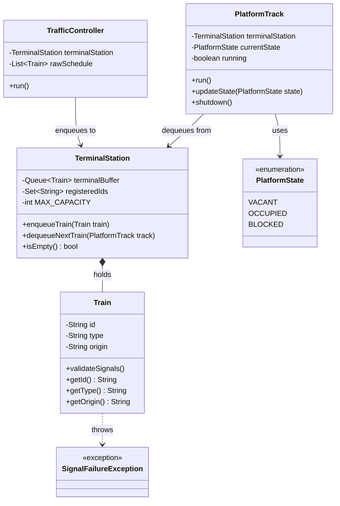
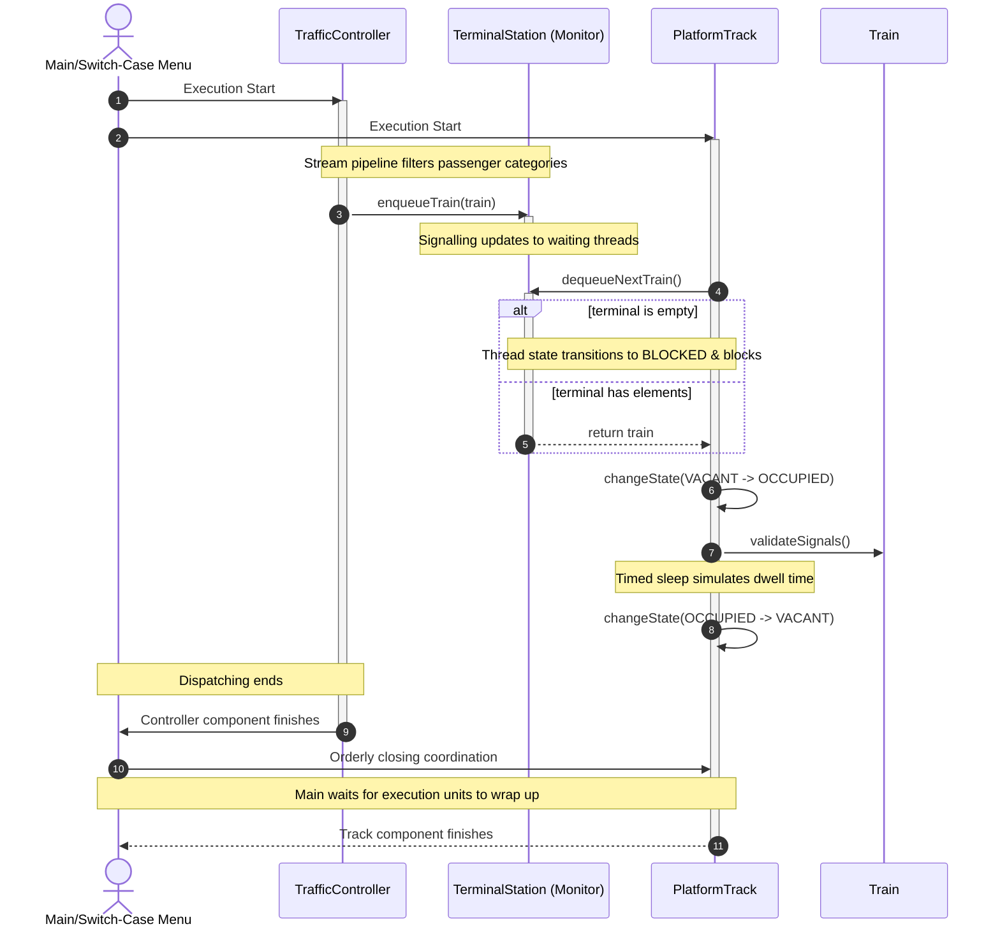

# Lab Test: Multi-Threaded Train Station Platform Allocation

You will simulate a busy central train hub where an automated traffic controller manages arriving train schedules and routes them onto a shared set of terminal platform tracks, while multiple platform supervisor components concurrently manage passenger workflows to clear the tracks for subsequent arrivals.

The system must process scheduling workflows safely in a concurrent environment and utilize modern Java functional pipelines to manage train arrivals.

---

## 1. Requirements & Grading Rubric

| Req. Code | Description | Max Points |
| :---: | :--- | :---: |
| **REQ-1** | **Train Model & Core Integrity:**   Implement a data component to represent a `Train` item with the following attributes: `id` (String), `type` (String, e.g., "InterCity", "Freight"), and `origin` (String).    * **Implementation Option A (Classic):** Define a standard class with a constructor and public accessor methods (getters).   * **Implementation Option B (Modern):** Define a single-line Java `record`.    To ensure data grid integrity, use a Hash-based collection (such as a `HashSet` or `HashMap`) to track unique train IDs globally. If a train arrives with an identification hash that has already been registered in the collection, skip it to prevent handling tracking duplication errors. | **1.5p** |
| **REQ-2** | **Functional Scheduling Pipeline:**   Before data enters the active terminal routing queue, the system must filter incoming scheduling batches using a **Java Stream pipeline with a lambda expression**. It must automatically filter out low-priority "Freight" trains during rush hour simulations, routing only commercial passenger categories to the active platform queue. This streaming operation should be invoked either from `main()` or within a dedicated coordinator component before items are submitted. | **1.0p** |
| **REQ-3** | **Active Traffic Controller Component:**   Implement a `TrafficController` component. This component acts as an independent execution unit that simulates real-time terminal approaches by generating batches of filtered valid trains at random time intervals and depositing them into the shared platform monitor buffer. *(Choose the appropriate multi-threading mechanism).* | **1.0p** |
| **REQ-4** | **Platform Worker Components:**   Implement a `PlatformTrack` component. Multiple track instances must run concurrently, acting as independent execution units that continuously pull train instances from the shared queue to process passenger boarding and unloading workflows. *(Choose the appropriate multi-threading mechanism).* | **1.0p** |
| **REQ-5** | **Thread Synchronization & Shared Resource Monitor:**   Implement the `TerminalStation` buffer which holds a maximum capacity of 4 available platform slots. You must handle synchronization safely so that worker tracks block when the terminal queue is completely empty, and the traffic controller blocks if all physical platforms reach their capacity limit. Ensure threads wake up immediately when the state changes. *(Hint: Use low-level thread signaling primitives inside synchronized blocks).* | **2.0p** |
| **REQ-6** | **Lifecycle Management & State Tracking:**   Simulate the physical time required to unload and clear a train using timed thread suspension. When the traffic controller finishes dispatching the scheduled arrivals, coordinate an orderly shutdown. Ensure that the master thread waits for all worker components to finish processing remaining trains before the program terminates. Track and update track activity dynamically using an enum (`PlatformState`: e.g., `VACANT`, `OCCUPIED`, `BLOCKED`). | **1.0p** |
| **REQ-7** | **Exceptional Flow Control:**   Create and handle at least two custom exceptions: a checked `SignalFailureException` (thrown if a train contains a null or unverified origin point) and an unchecked execution exception. Catch and log them gracefully without crashing the active processing threads. | **0.5p** |
| **REQ-8** | **Interactive Application Workflow (`main`):**   Implement the application's entry point inside the main class. The program should initialize the shared resources and start the concurrency layout. It must present a text-based console menu using a `switch-case` loop to allow the user to interactively test functionalities (e.g., *1. Run simulation*, *2. Trigger custom exception test*, *3. View processed train summary*, *4. Exit*). | **1.0p** |
| **BONUS** | **Project Naming Structure:**   **Gift Points:** Granted automatically if the project structure and package follow the exact convention naming rule: **`t3-train-allocation`**. | **1.0p** |
| | **Total Score Available** | **10.0p** |

---

## 2. Structural Class Diagram

### Sequence Diagram for the main workflow of the system:

